+++
title = 'Custom Mechanical Keyboard'
slug = 'custom-mechanical-keyboard'
date = 2026-01-10T12:00:00Z
draft = false
summary = 'A custom Atreus-inspired ergonomic keyboard built with a stainless switch plate, walnut case, and Kailh Bronze switches.'
description = 'Design and fabrication log for a fully custom mechanical keyboard.'
cover_image = 'images/keyboard-cover.svg'
cover_alt = 'Completed custom Atreus-style mechanical keyboard'
tech_stack = ['CNC milling', 'Laser cut steel', 'ATmega32U4', 'Hand wiring']
status = 'Complete'
+++

## Introduction

I spend a lot of time in front of a screen, both for work and recreation. Time on the computer ultimately means time spent with a keyboard: that magical piece of hardware that allows the trillions of transistors in a CPU to do whatever you want. I play video games, code, type emails, and browse the web all from the comfort of my desk. But, typing all day is hard on the hands.

The keyboard's design has remained largely unchanged for many years. The original layout of a keyboard was based on the necessity of a typewriter’s mechanical levers to not overlap and interfere with one another. That is why most modern keyboards have the rows of letters slightly offset. This, however, is neither ergonomic, nor necessary. Computer keyboards are essentially buttons that transmit electrical signals to the computer. There are no mechanical interferences to worry about anymore. So why not change? Muscle memory. People who have already learned to type would have to re-learn, and most people already dislike learning to type the first time, so there's not really a mainstream market. However, if the internet has taught me nothing else, it's that there are always people up to the challenge of doing what no one else will. Especially in the [mechanical keyboard community](https://geekhack.org/).

I first heard about mechanical keyboards from a co-worker while working at GE. He was oh-so proud of his newly acquired [Poker II](https://deskthority.net/wiki/KBC_Poker_II). I tried typing on it, and was intrigued by it's unusual 60% layout (no number pad, arrow keys, or function row). The clickety-clack of each key press was alluring. The actuation point was so predictable and the haptic feedback was so pleasing. I instantly fell in love with the typing experience. That's when I got my first mechanical keyboard: a Ducky Shine 3. It was a full-size keyboard (I was a bit nervous cutting down the key count). I eventually took another step and got a cheap 60% Magicforce keyboard. It was smaller and lighter and allowed me to take the fun, exact, typing experience on the road. But it still failed to be completely comfortable. My fingers still stretched at unnatural angles.

After reading dozens of forum posts and doing hours of research, I found a solution I thought I might like. The [Atreus](https://atreus.technomancy.us/) keyboard is small, mechanical, and ergonomic. As a bonus, it is an open source keyboard: perfect for a tinkerer like me. I started planning and researching my build — pricing parts, fabrication options, and looking at ways to customize it and make it my own.


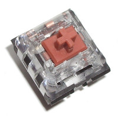
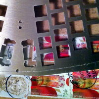
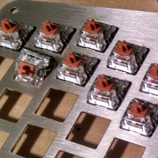
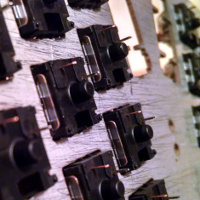


## Design

The first real task was defining the overall appearance of the keyboard. The Atreus kit comes with blank black keycaps and a sandwich-style, layered, laser cut, wood case. This is a nice baseline and I'm sure it helps on the costs, but I wanted something more … custom. I opted for the [Carbon keyset](https://www.massdrop.com/buy/carbon?mode=guest_open), a nice dark grey, cream, and orange cap set manufactured by Signature Plastic. This was my first purchase with by far the longest lead time: about 10 months.

Next, I like the whole industrial feel so I chose to go with stainless steel for the switch plate. [Lasergist.com](http://lasergist.com/laser-cut-custom-keyboards/) provides a quality job of laser cutting 1.5mm thick 316 SS for keyboards. The nearly month-long wait was much longer than the advertised 10 day shipping. I can only guess that this was due to a customs checkpoint, as it was shipped from Greece. At over $70 dollars for the 42-key plate, it was quite pricey, but the quality was worth it to me.

I modified the switch plate slightly to account for the 2u thumb keycaps that I ordered. (The original design, found on [Technomancy's GitHub](https://github.com/technomancy/atreus) page, calls for 1.5u keys.) The longer thumb keys required the addition of stabilizers and separating the right and left sides apart slightly to prevent the keys from hitting each other. Next, since the base is one solid piece, I decided to remove the two screws next to the thumbs and replace them with a single screw in the center. One last modification in the switch plate design, I added cutouts for two, 3mm LEDs which I will use to indicate the keyboard layer (I may decide to change the behavior later.) I used Swill's [Keyboard Builder Tool](http://builder.swillkb.com/) along with [KLE](http://www.keyboard-layout-editor.com/) to help with the modifications.

The heart and soul of any mechanical keyboard is the switch — the part that is pressed and sends an electrical signal to the computer. I already had two keyboards, one with Cherry Browns, the other Gateron Blues. I liked the feel of the blues more than the browns, but I didn't want something the same. I looked at different options before settling on the [Kailh Bronze](https://input.club/the-comparative-guide-to-mechanical-switches/tactile-clicky/kaihua-bronze/) switch. It is, like the blues, a tactile "clicky" switch. The difference is that it has an actuation travel of only 1.25mm with only 40 grams of force, compared to 2mm travel and 55 grams of force for the Cherry Blue.

For the brains of the keyboard, the controller, I chose the Pololu [A-Star 32U4 Micro](https://www.pololu.com/product/3101). It is the board that comes in the Atreus kit, so I knew there wouldn't be any issues with compatibility. It also has the plus of being the cheapest board with the ATmega32U4 chip that I could find. One drawback, to me, was its Micro USB interface. I would have preferred a USB-C plug (I love that it is reversible), but I guess that the industry is still catching up.

Rounding things out is the base. I designed my custom case out of walnut to contrast the steel switch plate that sits atop it. The wood base gives the keyboard a sturdy look without being too imposing. I was lucky enough to have an uncle that owns a CNC router. After a few prototypes in plywood and a few design changes, the final product came out perfectly. I added a few rubber feet on the back to prevent anything from getting scratched.


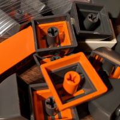
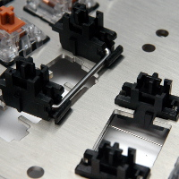
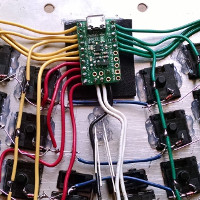
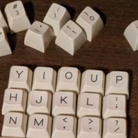


## Implementation

With the separate pieces gathered together, I began the build. The keys snapped very easily into place on the switch plate. I then secured each switch with a little bead of hot glue to prevent them from moving. After finishing all the switches, I started soldering the diodes together. The diodes form the rows of the matrix. I was careful to make sure each diode was soldered to the next diode's positive lead to prevent problems later on. The diodes were pretty time consuming taking about 2 hours total. I clipped the ends as I was going. The columns were next. I used some solid core wire for this. The colors in the photo are as follows:

- **Yellow**: Right hand side columns
- **Green**: Left hand side columns
- **Red**: Rows to controller
- **Blue**: Connect rows across the gap

Once the switches were all wired up, I loaded up the [Atreus firmware](https://atreus.technomancy.us/download) onto the A-Star board. I was quite pleased with how well documented the procedure was. When I first got it installed, I had the board flipped, so I simply loaded the other precompiled firmware and all was right. With notepad open, I pressed each key to make sure they all worked. Presto! At this point I had a working keyboard!

The most time-consuming part of this build was definitely the wooden case. I received the rough-cut walnut piece from my uncle. The slanted front edge was far from smooth. The stepper motors left tiny gouges that would require a fair amount of sanding. Before I went to all that work, I had to make sure the plate and switches fit in the case. The stainless steel plate mounts onto the wooden base with 7 M3 machine screws. But machine screws don't work for wood. That's why I got some [E-Z Knife Threaded Inserts](https://www.ezlok.com/ezknife-insert-400-M3). These were not the easiest to install. I tried the first one with a screwdriver and no lubricant. The main problem was that it got started at a slant because of the threads. I decided to take a different route for the others. I rigged up a drill press, and — using a machine screw loaded up with 4 or 5 nuts — threaded the inserts into the base using some beeswax to lubricate them. With the inserts installed, I was quite pleased that the switch plate fit nicely and securely into the base.

Then came the sanding. And sanding. And more sanding. I started out with 120 grit and cleaned up all of the really rough parts, taking off a fair amount of material. I switched to 220 grit once the gouges and divots were removed. I sanded the inside and outside; the edges, top and bottom. Finally, I sanded the exterior with 400 grit sandpaper to get everything as smooth as possible. (The inside wasn't going to be seen so that didn't need to be as smooth.) The last step to completing the case was staining it. I had several options to choose from, and I wasn't quite sure how they would turn out. So I masked off three segments inside the case with painters tape and did a test run. I tried water-based Polyurethane, oil-based Polyurethane, and [Watco Danish Oil](https://www.rustoleum.com/product-catalog/consumer-brands/watco/danish-oil), and I really liked how the Danish Oil brought out the grain of the wood. I put two layers of that down, lightly sanding with 400 grit in between applications. To help give it a little more rugged finish, I applied a single layer of nearly clear, water-based Polyurethane over that. And when it was all cured, I assembled it one last time.


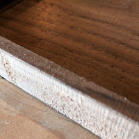
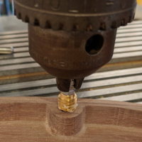
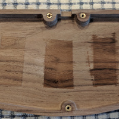
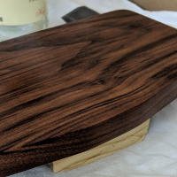


## Final Thoughts

This was a very fun and rewarding project. I learned a lot about designing for manufacturing. Originally, the sides of the keyboard were completely vertical. However, the routing bit that the CNC used had a slight 3° slant to it. I had to design around this and adjust the wall thickness. I also learned a lot about how keyboards function and the amount of thought that goes into making a multiplexed data entry device. Each key could be assigned its own input, but that is not necessary and you can easily get more inputs than I/O points with the added heft of some smart programming. If I had to do it over again, I would probably have chosen a different switch. One thing that was not made apparent in my research about the Kailh Speed Switches was that the actuation point — the point where the keypress is registered — actually happens before the tactile feedback. This leads to mis-typing quite easily.

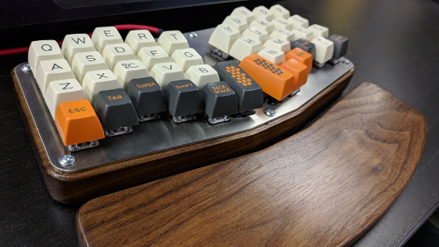
